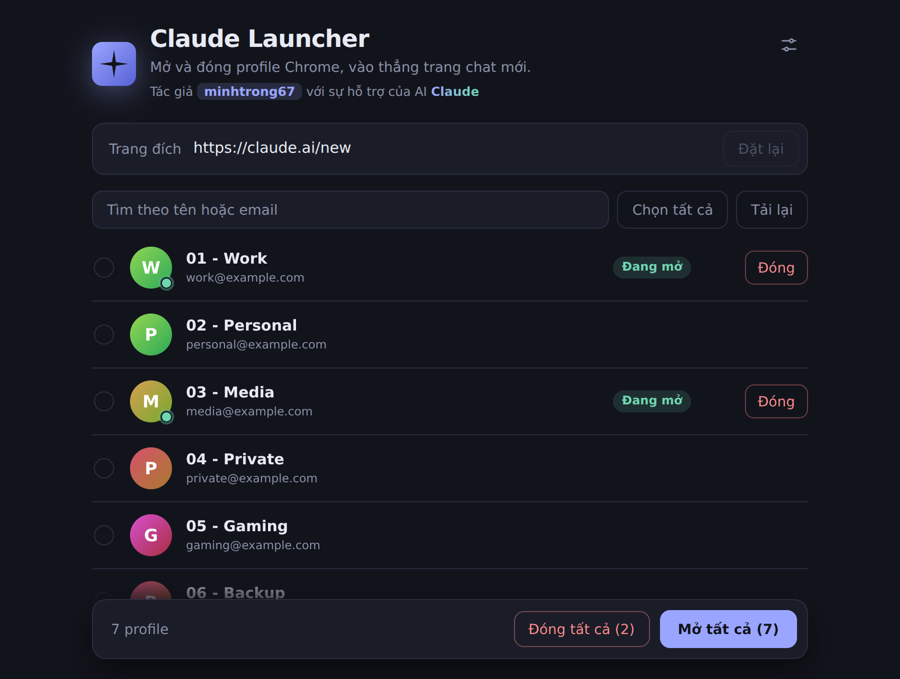
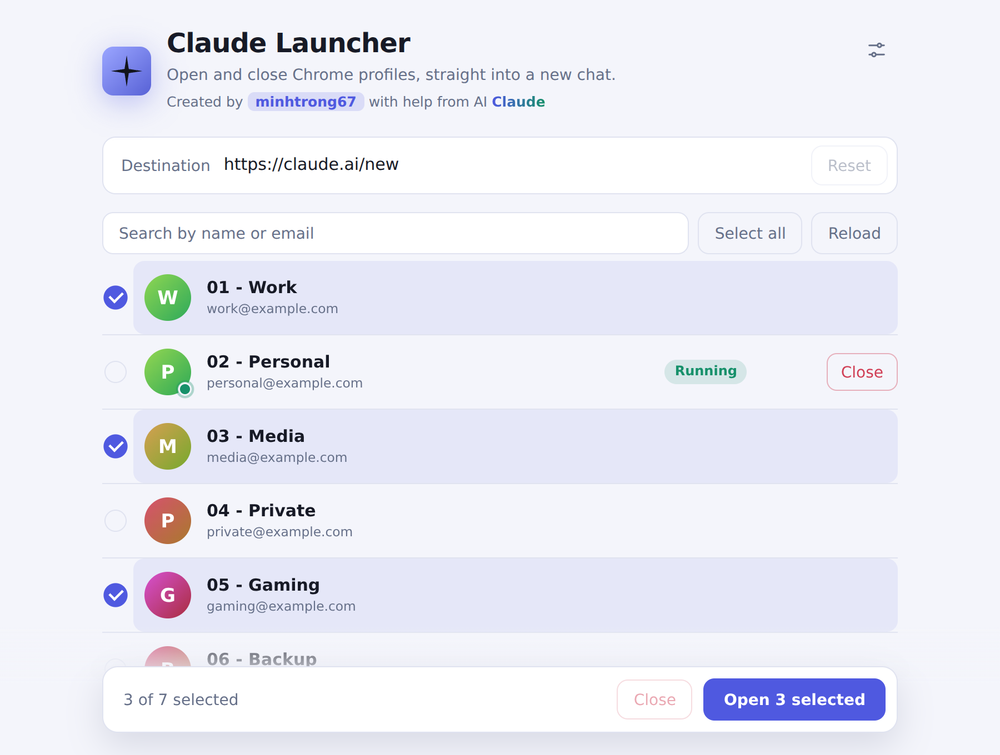
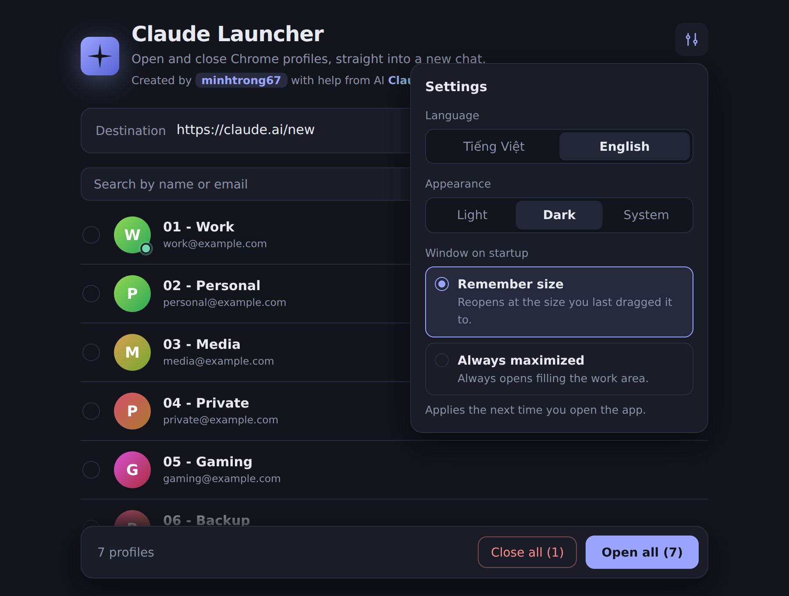
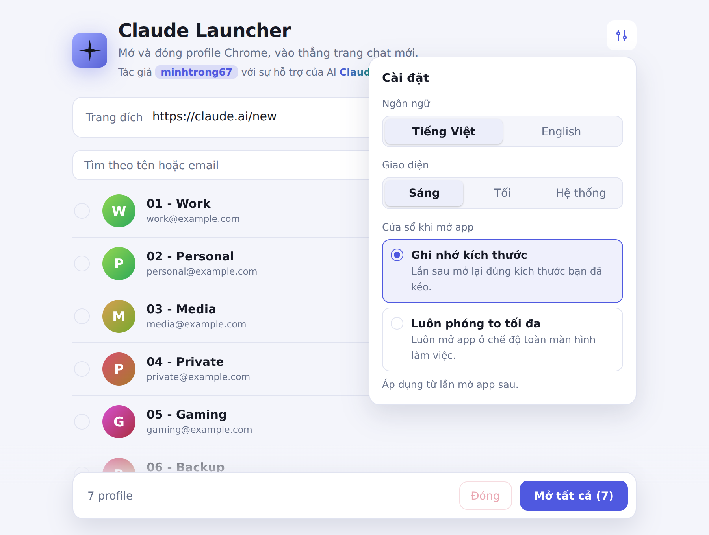

<div align="center">


# Claude Launcher

**Mở và đóng các profile Chrome chỉ với một cú click, vào thẳng trang chat Claude mới.**


[English](README.md) · Tiếng Việt

</div>

Tác giả **minhtrong67**, với sự hỗ trợ của AI **Claude**.

## Giới thiệu

Nếu bạn dùng nhiều profile Chrome (công việc, cá nhân, giải trí, dự phòng...), việc mở từng profile rồi vào cùng một trang rất tốn thời gian. **Claude Launcher** đọc danh sách profile Chrome của bạn, rồi mở một hoặc nhiều profile cùng lúc, vào thẳng `https://claude.ai/new`. Ứng dụng cũng đóng được profile và cho biết profile nào đang chạy.

Đây là một ứng dụng native nhỏ gọn: backend Rust, giao diện React, dung lượng chỉ vài MB.

## Ảnh chụp màn hình

<table>
  <tr>
    <td></td>
    <td></td>
  </tr>
  <tr>
    <td></td>
    <td></td>
  </tr>
</table>

> Ảnh là bản render của giao diện thật với dữ liệu profile mẫu.

## Tính năng

- **Mở nhanh.** Click một profile để mở vào trang đích. Chọn nhiều profile để mở cùng lúc, hoặc mở tất cả.
- **Đóng profile.** Đóng một profile, các profile đã chọn hoặc tất cả profile đang chạy. Chrome nhận yêu cầu đóng cửa sổ bình thường nên vẫn khôi phục được tab ở lần sau.
- **Trạng thái trực tiếp.** Chấm xanh và nhãn "Đang mở" cho biết profile nào đang chạy; danh sách tự cập nhật khi cửa sổ đang hiển thị.
- **Trang đích tùy ý.** Mặc định là `https://claude.ai/new`, bạn có thể đổi sang địa chỉ `http(s)` bất kỳ và app sẽ nhớ.
- **Tìm kiếm và phím tắt.** Lọc theo tên hoặc email. `Ctrl+F` để tìm, `Ctrl+A` chọn tất cả, `Esc` để xóa tìm kiếm, bỏ chọn hoặc đóng cài đặt.
- **Giao diện sáng, tối hoặc theo hệ thống**, chuyển mượt mà. Thanh tiêu đề gốc cũng đổi theo.
- **Tiếng Việt và tiếng Anh**, đổi bất cứ lúc nào.
- **Cửa sổ khi mở app.** Chọn *ghi nhớ kích thước* bạn đã kéo, hoặc *luôn phóng to tối đa*.
- **Mượt và nhẹ.** Hiệu ứng xuất hiện lần lượt, khung chờ khi tải, ảnh profile chỉ tải khi cần, hỗ trợ giảm chuyển động.
- **Bộ cài có thương hiệu.** Icon app, setup và uninstall theo kích thước chuẩn Windows, kèm hình nền trình cài đặt, trình cài đặt có tiếng Việt và tiếng Anh.

## Cài đặt

### Yêu cầu

- Windows 10 hoặc 11 (đóng profile chỉ hỗ trợ Windows; mở profile chạy được cả macOS và Linux)
- Google Chrome
- Microsoft Edge WebView2 Runtime (Windows 11 đã có sẵn)

### Cài bằng file setup

1. Build bộ cài (xem phần [Build](#build)) hoặc tải từ trang releases của bạn.
2. Chạy `Claude Launcher_0.1.0_x64-setup.exe`. Bộ cài cài cho người dùng hiện tại, không cần quyền quản trị.
3. Mở **Claude Launcher** từ Start menu.

Không muốn cài? Chép `target/release/claude-launcher.exe` ra bất kỳ đâu và chạy.

> Mỗi profile cần đăng nhập sẵn Claude thì mới vào thẳng khung chat.

## Công nghệ sử dụng

| Lớp | Công nghệ |
| --- | --- |
| Khung ứng dụng | [Tauri 2](https://tauri.app) (Rust) |
| Giao diện | React 18, Vite 6 |
| Style | CSS thuần với design token, hai giao diện sáng và tối |
| Backend | Rust, `serde_json`, gọi trực tiếp Win32 (`user32`, `kernel32`) |
| Bộ cài | NSIS, cài theo người dùng |

## Phát triển

Yêu cầu: [Node.js](https://nodejs.org) 18+, [Rust](https://rustup.rs) (stable) và [điều kiện cần của Tauri trên Windows](https://tauri.app/start/prerequisites/) (Microsoft C++ Build Tools).

```bash
npm install     # cài thư viện
npm run dev     # chạy app ở chế độ phát triển, có hot reload
```

Project nằm trong một Cargo workspace (`members = ["*/src-tauri"]`) nên các bản build Rust dùng chung thư mục `target` của workspace.

## Build

```bash
npm run build
```

Kết quả, tính từ thư mục gốc của workspace:

- `target/release/claude-launcher.exe`: file chạy độc lập
- `target/release/bundle/nsis/`: bộ cài

Nếu Chrome cài ở vị trí khác thường, chỉnh hàm `chrome_path()` trong `src-tauri/src/main.rs`.

### Cách đóng profile hoạt động

App theo dõi các cửa sổ Chrome do chính nó mở, đồng thời nhận ra cửa sổ có tiêu đề kết thúc bằng tên profile (Chrome hiển thị tên này khi bạn dùng nhiều profile). Chỉ cửa sổ thuộc `chrome.exe` mới bị tác động.

## Cấu trúc project

```
claude-launcher/
├── src/
│   ├── components/
│   │   ├── Avatar.jsx          # ảnh profile, dự phòng bằng chữ cái
│   │   ├── Icons.jsx           # logo và icon
│   │   ├── Row.jsx             # một dòng profile
│   │   └── SettingsPanel.jsx   # ngôn ngữ, giao diện, cửa sổ
│   ├── App.jsx                 # màn hình chính và logic
│   ├── i18n.js                 # chuỗi tiếng Việt và tiếng Anh
│   ├── main.jsx                # điểm khởi chạy
│   ├── settings.js             # lưu cài đặt
│   ├── styles.js               # CSS (sáng và tối)
│   └── tauri.js                # lớp bọc Tauri API
├── src-tauri/
│   ├── capabilities/           # quyền của cửa sổ
│   ├── icons/                  # icon app, setup, uninstall, ảnh trình cài đặt
│   ├── src/main.rs             # liệt kê, mở, đóng và dò profile
│   ├── Cargo.toml
│   └── tauri.conf.json
├── screenshots/                # image01.png ... image04.png
├── index.html
├── package.json
├── vite.config.js
├── LICENSE
└── README.md
```

## Giấy phép

Phát hành theo [Giấy phép MIT](LICENSE). Bản quyền © 2026 **minhtrong67**.

---

<div align="center">

Thực hiện bởi **minhtrong67** · với sự hỗ trợ của AI **Claude**

</div>
