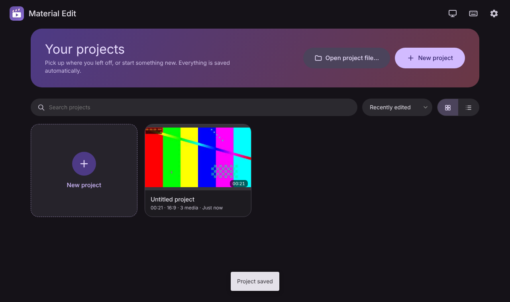
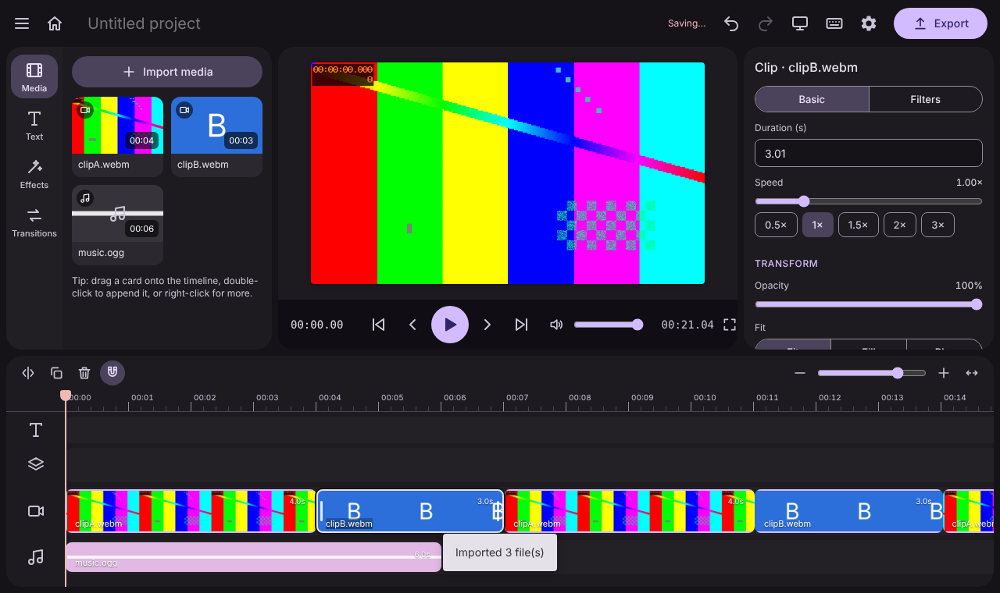
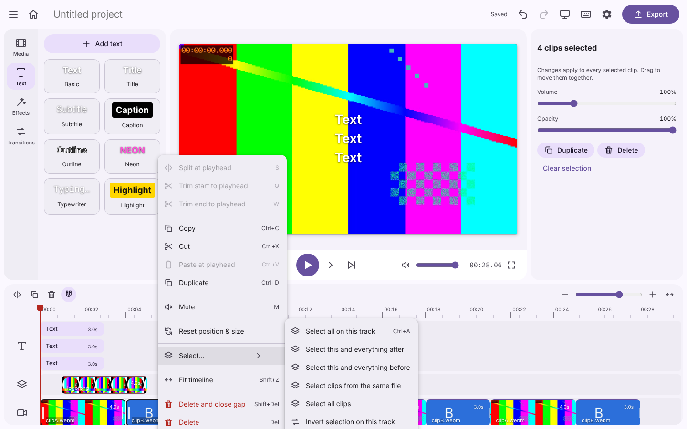
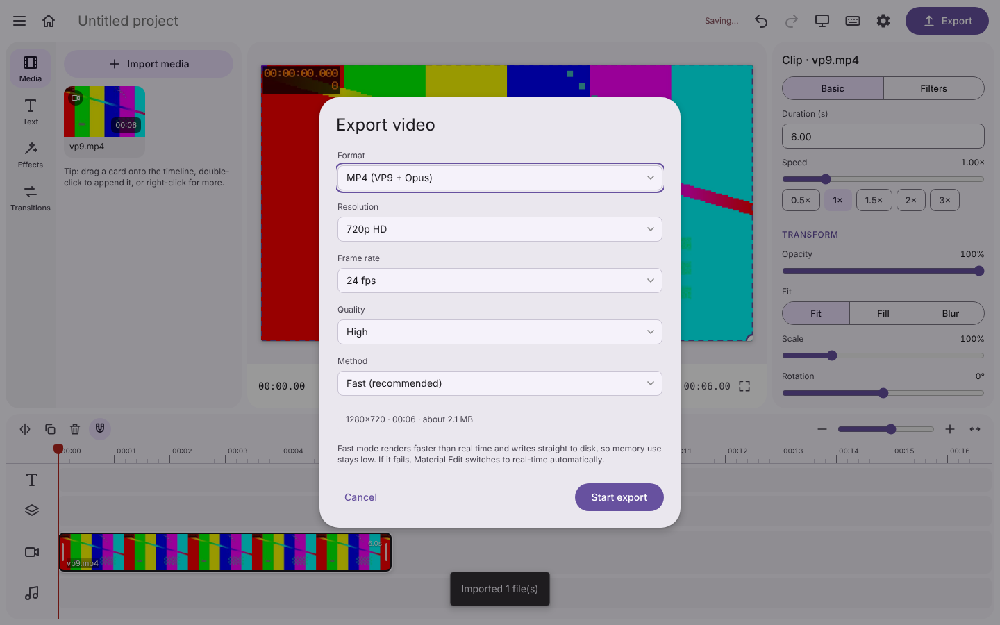
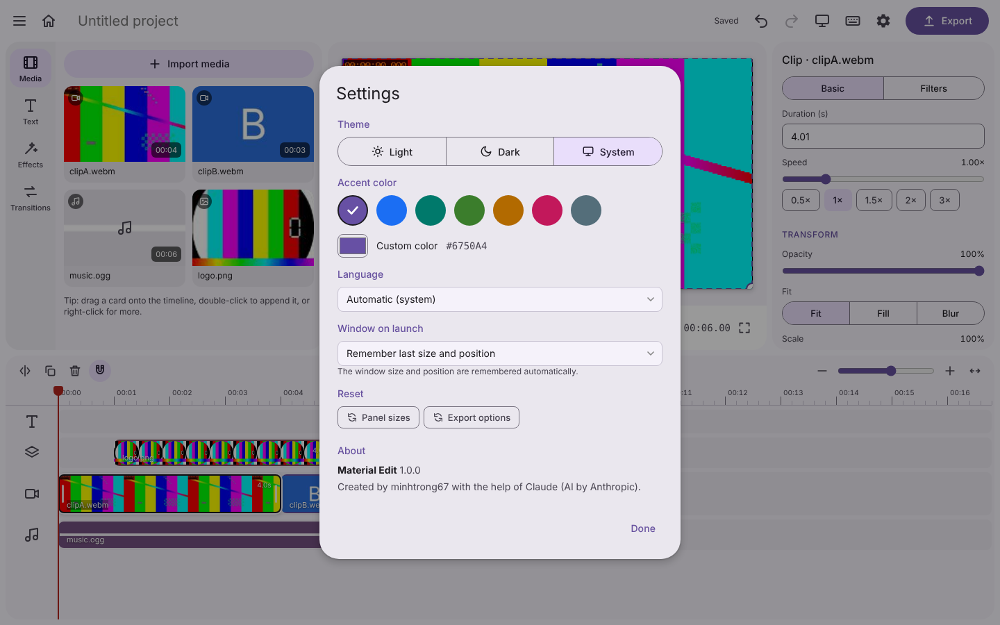

<div align="center">


# Material Edit

**A simple, CapCut-inspired video editor with a Material Design 3 look.**
*Trình chỉnh sửa video đơn giản, lấy cảm hứng từ CapCut, thiết kế theo Material Design 3.*

[](https://tauri.app) [](LICENSE) [](#features--tính-năng)

Created by **minhtrong67** · with AI assistance from **Claude** (Anthropic)

</div>

---

## Screenshots

| Project library | Editor |
|---|---|
|  |  |
| **Context menu** | **Export** |
|  |  |
| **Settings** | |
|  | |

## Features / Tính năng

- **Project library** – press Save and your project shows up on the home screen next time (grid or list, search, sort, rename, duplicate, delete). Click to keep editing. Autosave included.
- **Resizable panels** – drag the splitters between the media panel, preview, inspector and timeline; sizes are remembered. Full-screen preview (`F`).
- **Multi-track timeline** – text, overlay, main (ripple) and audio tracks; move, trim, reorder, snap, zoom, scrub; overlapping text/overlay clips are stacked in lanes; **Fit timeline** button (`Shift+Z`).
- **Quick selection** – rubber-band (drag) selection in the timeline and media library, Ctrl/Shift+click, and *Select…* in the context menu (whole track, everything before/after, same source file, invert). Bulk move, copy, duplicate, mute, delete and volume/opacity edits.
- **Match length** – right-click a video/image → *Match this clip's length to the audio*. Shorter clips are looped (duplicated), longer ones trimmed; works for images and for the whole video track.
- **Context menus & shortcuts** – everywhere, with the familiar editor keys (see below).
- **Transitions, filters, text, speed, volume, fades, aspect ratios** (16:9, 9:16, 1:1, 4:3, 21:9).
- **Smooth preview for 2K/4K** – large MP4 videos get a small preview copy once (cached in the temp folder, toggle in Settings); scrubbing and playback stay fluid while export still uses the original. The preview is rendered crisp (≥1.5× supersampling, high-quality scaling) and only repaints when something changes.
- **Fast, RAM-safe export** – faster than real time, written straight to disk (see *Export*). Choose the file name and folder in the export window (or set a default export folder in Settings); your last export options are remembered.
- **Window memory** – size, position and maximised state are restored; optional "always start full screen".
- **Material Design 3** – dynamic colour from any seed, light / dark / system, smooth motion (respects *reduced motion*).
- **English & Tiếng Việt** UI.

## Shortcuts / Phím tắt

Press `Ctrl+/` (or `?`) in the app for the full list.

| Key | Action | Key | Action |
|---|---|---|---|
| Space / K | Play / pause | S, Ctrl+B / K | Split at playhead |
| ← / → | Step one frame (Shift: 1 s) | Q / W | Trim start / end to playhead |
| ↑ / ↓ | Previous / next cut | Delete / Shift+Delete | Delete / ripple delete |
| Home / End | Start / end | Ctrl+C / X / V / D | Copy / cut / paste / duplicate |
| F, F11 | Full-screen preview | M | Mute clip |
| Ctrl+Z / Ctrl+Y | Undo / redo | T | Add text |
| Ctrl+A | Select all | Esc | Clear selection |
| = / - , \ | Zoom in / out, fit | N | Toggle snapping |
| Ctrl+N / O / S | New / open / save | Ctrl+I / Ctrl+E | Import / export |
| Ctrl+Shift+H | Project library | Ctrl+, | Settings |

## Download

Installers are produced by `npm run build` (see below) and appear in `target/release/bundle/` of your Cargo workspace (e.g. NSIS `.exe` on Windows).

## Install

Run the installer. The app, installer and uninstaller carry the Material Edit icon set (16–512 px PNG, multi-size `.ico`, `.icns`, Windows Store logos).

## Export

| Mode | How it works | Notes |
|---|---|---|
| **Fast** (default) | Frame-exact decode (WebCodecs) → canvas composition → encode (WebCodecs) → streaming muxer → file | Faster than real time; RAM stays flat because data is written to disk as it is produced. |
| **Real-time** | Records the canvas + audio mix with `MediaRecorder` | Most compatible; takes as long as the video. Chunks are streamed to disk. |

Safety measures: bounded decoder/encoder queues, capped pending disk writes, a memory budget for decoded audio, and an automatic switch to real-time mode if the fast path is unavailable or fails. Cancel any time.

## Tech stack

Tauri 2 (Rust) · vanilla ES modules · Canvas 2D · WebAudio · WebCodecs · [mp4-muxer / webm-muxer](https://github.com/Vanilagy/mp4-muxer) (MIT, vendored in `src/vendor`) · Material Design 3 tokens generated at runtime.

## Development

Requirements: Node.js 18+, Rust (stable) and the [Tauri prerequisites](https://tauri.app/start/prerequisites/).

```bash
npm install
npm run dev      # run in development
```

The project is a member of a Cargo workspace (`members = ["*/src-tauri"]`) and shares its `target/` folder. If you rename or move the workspace folder, run `cargo clean` once.

## Build

```bash
npm run build    # installers (NSIS on Windows)
npm run icons    # regenerate icons (Python + Pillow)
```

## Notes / Lưu ý

- Projects store **paths** to your media (they are never copied). If a file moves, the clip shows as offline and can be relinked.
- The fast path decodes MP4/MOV directly; other formats (WebM, MKV…) are decoded by seeking, which is slower but still frame-exact. H.264/AAC encoding depends on the system webview (WebView2 on Windows supports it).
- Videos whose audio would need too much memory to mix (very large files) are exported in real-time mode.
- Canvas filters are not supported by WebKit-based webviews (macOS/Linux).
- Optional: install [FFmpeg](https://ffmpeg.org/) to enable "MP4 via FFmpeg" for real-time recordings.

## Project structure

```
src/            UI (ES modules): store, engine, timeline, inspector, home, exporter, export-fast, mp4demux…
src/vendor/     mp4-muxer, webm-muxer (MIT)
src-tauri/      Rust backend (media server, project library), config, icons
screenshots/    README images
tools/          Icon generator
```

## License

[MIT](LICENSE) © 2026 minhtrong67. Bundled mp4-muxer / webm-muxer: MIT © Vanilagy (see `src/vendor/LICENSE-mp4-muxer.txt`).
