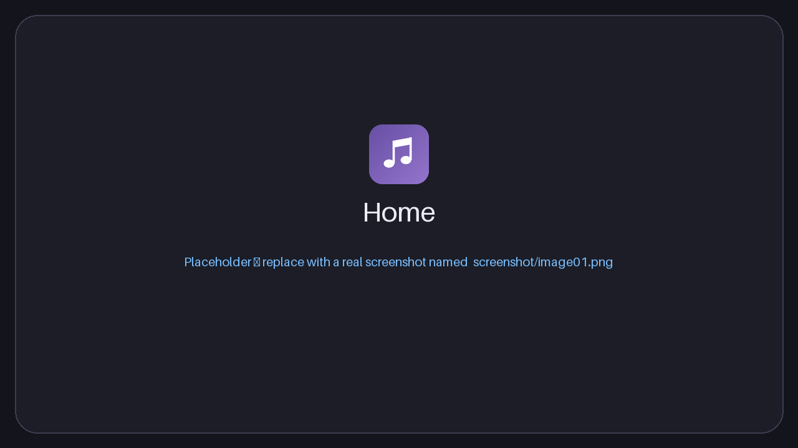
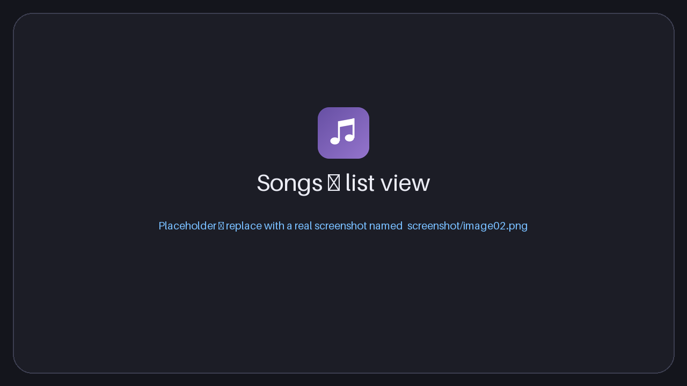
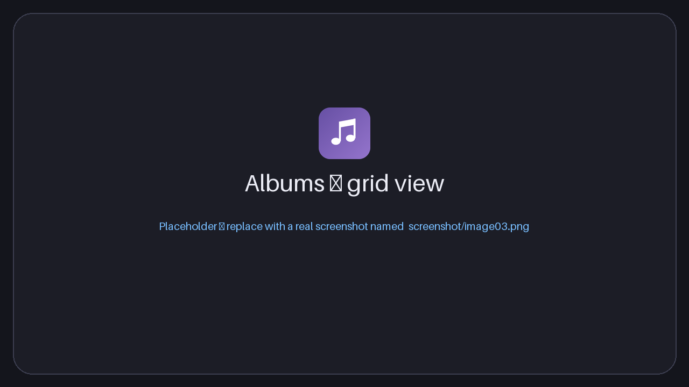
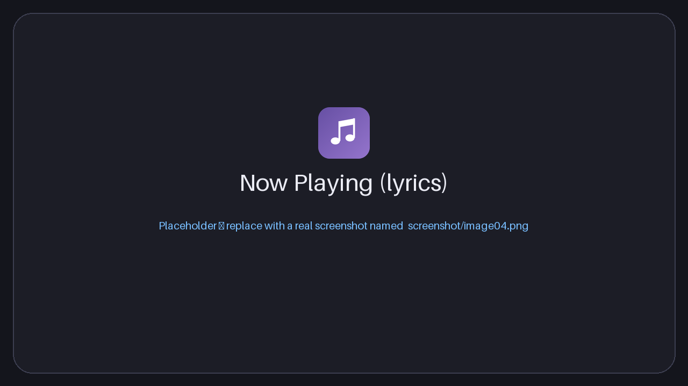
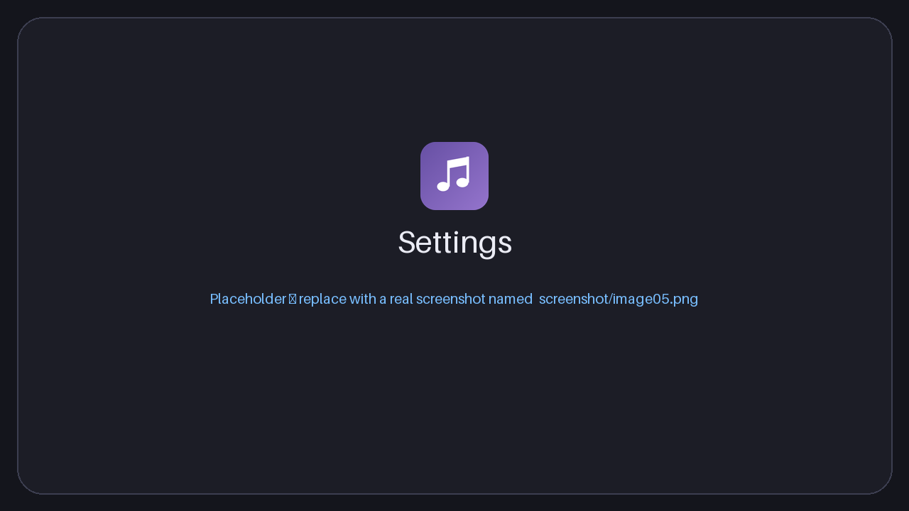

<div align="center">


# Material Music Player

**Trình phát nhạc local đẹp mắt cho Windows, giao diện Material Design 3.**


[English](README.md) · Tiếng Việt

</div>

---

## Mục lục

1. [Giới thiệu](#giới-thiệu)
2. [Screenshot](#screenshot)
3. [Tính năng](#tính-năng)
4. [Download](#download)
5. [Cài đặt](#cài-đặt)
6. [Tech stack](#tech-stack)
7. [Development](#development)
8. [Build](#build)
9. [Cấu trúc project](#cấu-trúc-project)
10. [License](#license)

---

## Giới thiệu

**Material Music Player** phát nhạc lưu trên máy tính của bạn. Ứng dụng xây dựng bằng [Tauri](https://tauri.app), React và Rust nên nhỏ, nhanh, ít tốn bộ nhớ, và mang giao diện **Material Design 3** hiện đại:

- **Hệ màu Material You** sinh từ một màu chủ đề bạn chọn – hoặc từ ảnh bìa bài đang phát – ở chế độ **sáng**, **tối** hoặc **theo hệ thống**.
- Giao diện **Tiếng Việt và English**, đổi bất cứ lúc nào.
- **Font hệ thống** (`system-ui`) – font gốc của Windows, không đóng gói font riêng.
- **Thư viện** tự quét thư mục *Music* của Windows, đọc thẻ nhạc và ảnh bìa, tạo playlist từ thư mục.
- Đầy đủ trình phát: hàng chờ, playlist, equalizer, lời bài hát đồng bộ, hẹn giờ tắt, trình phát mini và nhiều hơn nữa.

> ✨ Thiết kế và phát triển bởi **minhtrong67** — với sự hỗ trợ của trợ lý AI **Claude** (Anthropic).

## Screenshot

> Các ảnh nằm trong thư mục [`screenshot`](screenshot) và đặt tên `image01.png`, `image02.png`, `image03.png`… Hãy thay từng ảnh giữ chỗ bằng ảnh chụp thật, giữ nguyên tên tệp.

| Trang chủ | Bài hát (danh sách) |
|:---:|:---:|
|  |  |

| Album (dạng ô) | Đang phát |
|:---:|:---:|
|  |  |

| Cài đặt |
|:---:|
|  |

## Tính năng

### Thư viện
- **Nhập thư mục** (đệ quy) – tự thành playlist, có nút *Quét lại* để đồng bộ.
- Nhập từng tệp, **kéo thả** tệp hoặc thư mục, hoặc **Mở bằng** từ Explorer (mp3, flac, wav, ogg, opus, m4a, aac).
- **Tự động quét thư mục Music của Windows** khi mở app; **nút Làm mới** (thanh tiêu đề hoặc `F5`) quét ngay. Bài mới được thêm, bài đã đổi được cập nhật, bài đã xóa bị gỡ khỏi thư viện.
- Nhập lại bài đã có sẽ **ghi đè** chứ không tạo bản sao (nhận diện theo đường dẫn); ổ đĩa tạm thời không kết nối sẽ không làm mất thư viện.
- Đọc thẻ nhạc (tên, nghệ sĩ, album, năm, thể loại, track) và **ảnh bìa** nhúng bằng `lofty`.
- Duyệt theo Bài hát, Album, Nghệ sĩ, Playlist, Yêu thích, Gần đây – mọi tab đều có **dạng danh sách / dạng ô**, tìm kiếm không dấu (`Ctrl+F`) và sắp xếp.
- Danh sách ảo hoá: mượt với hàng chục nghìn bài.
- Sao lưu / khôi phục thư viện (JSON), xóa tệp bị thiếu.

### Phát nhạc
- Phát / tạm dừng, bài trước / sau, tua, âm lượng, ngẫu nhiên, lặp (tắt / tất cả / một bài).
- Hàng chờ: phát tiếp theo, thêm vào hàng chờ, kéo thả sắp xếp.
- Playlist: tạo, đổi tên, xóa, sắp xếp, nhập / xuất **M3U / M3U8**.
- **Equalizer 10 băng tần** có preset và preamp, tốc độ phát 0.5× – 2×.
- **Lời bài hát đồng bộ** (tệp `.lrc` cạnh bài hoặc nhúng trong thẻ) – bấm vào dòng để tua.
- Visualizer phổ âm thanh, màn hình *Đang phát* toàn khung và **trình phát mini** luôn ở trên cùng.
- Hẹn giờ tắt (15 – 120 phút hoặc hết bài hiện tại), phím media của Windows, khôi phục phiên trước.

### Giao diện & ngôn ngữ
- Chủ đề sáng, tối hoặc theo hệ thống; màu có sẵn + màu tùy chọn; **màu động theo ảnh bìa**.
- Giao diện Tiếng Việt / English, mặc định tự theo hệ thống.
- Chuyển động mượt kiểu Material: thẻ xuất hiện lần lượt, nhấc lên khi rê chuột, nút chuyển trượt, phản hồi khi bấm và chuyển màn hình (tự giảm khi tắt hiệu ứng động của Windows).

### Tích hợp Windows
- **Ghi nhớ kích thước, vị trí và trạng thái phóng to của cửa sổ**, lần sau mở lại đúng như cũ (chế độ toàn màn hình và mini không bao giờ bị lưu; nếu màn hình đã rút khỏi máy, cửa sổ tự về giữa màn hình).
- Tùy chọn **"Luôn mở ở chế độ toàn màn hình"** trong *Cài đặt → Hệ thống* (`F11` hoặc `Esc` để thoát).
- Khay hệ thống có phát / tạm dừng / trước / sau, tùy chọn *đóng xuống khay*, luôn ở trên cùng, chỉ chạy một cửa sổ.
- Thanh tiêu đề Material tự vẽ.

### Phím tắt

| Phím | Chức năng | Phím | Chức năng |
|---|---|---|---|
| `Space` | Phát / tạm dừng | `M` | Tắt tiếng |
| `Ctrl+←` / `Ctrl+→` | Bài trước / sau | `S` | Ngẫu nhiên |
| `←` / `→` | Tua 5 giây | `R` | Chế độ lặp |
| `↑` / `↓` | Âm lượng | `L` | Yêu thích bài đang phát |
| `Q` | Hàng chờ | `N` | Màn hình đang phát |
| `Ctrl+F` | Tìm kiếm | `F5` | Làm mới thư viện |
| `F11` | Toàn màn hình | `Esc` | Đóng cửa sổ / thoát toàn màn hình |

## Download

Tải bộ cài mới nhất ở trang **Releases** của repository này:

| Tệp | Mô tả |
|---|---|
| `Material Music Player_1.0.0_x64-setup.exe` | Bộ cài cho Windows 10 / 11 (64-bit) – khuyên dùng |

| Yêu cầu hệ thống | |
|---|---|
| Hệ điều hành | Windows 10 (1809 trở lên) hoặc Windows 11, 64-bit |
| Runtime | Microsoft Edge WebView2 (có sẵn trên Windows 11 và Windows 10 đã cập nhật) |

Định dạng âm thanh hỗ trợ: **MP3, FLAC, WAV, OGG, Opus, M4A, AAC** (phát bằng bộ giải mã WebView2). Muốn tự build? Xem mục [Build](#build).

## Cài đặt

1. Chạy **`Material Music Player_1.0.0_x64-setup.exe`**. Bộ cài cài theo từng người dùng nên **không cần quyền quản trị**.
2. Nếu Windows SmartScreen hiện *"Windows protected your PC"* (bộ cài chưa ký số), bấm **More info → Run anyway**.
3. Làm theo trình cài đặt rồi mở **Material Music Player** từ Start menu.
4. Ứng dụng tự quét thư mục **Music**; thêm thư mục khác bằng *Thêm thư mục* hoặc kéo thả vào cửa sổ.

**Gỡ cài đặt** – *Settings → Apps → Installed apps → Material Music Player → Uninstall* (hoặc chạy `uninstall.exe` trong thư mục cài đặt). Dữ liệu nằm ở `%APPDATA%\com.minhtrong67.material-music-player`, bộ nhớ đệm ảnh bìa ở `%LOCALAPPDATA%\com.minhtrong67.material-music-player`; xóa hai thư mục này nếu muốn gỡ sạch hoàn toàn.

**Nâng cấp từ "Melodia"** – lần mở đầu tiên app tự nhập thư viện đã lưu của bản Melodia cũ.

| Sự cố | Cách xử lý |
|---|---|
| Equalizer / visualizer không hoạt động | WebView không cho xử lý âm thanh với tệp cục bộ; nhạc vẫn phát bình thường và hộp thoại có thông báo. |
| Sau khi cài lại vẫn hiện icon cũ | Windows lưu cache icon – đổi tên tệp hoặc khởi động lại Explorer. |
| Không phát được một bài | Tệp có thể bị thiếu hoặc hỏng; app tự chuyển sang bài tiếp theo và hiện thông báo. |

## Tech stack

| Tầng | Công nghệ |
|---|---|
| Lõi desktop | [Tauri 2](https://tauri.app) (Rust) – khay hệ thống, single-instance, hộp thoại, asset protocol, liên kết tệp |
| Giao diện | [React 18](https://react.dev) + [TypeScript 5](https://www.typescriptlang.org) |
| Công cụ build | [Vite 5](https://vitejs.dev) |
| Styling | [Tailwind CSS 3](https://tailwindcss.com) với design token Material 3 |
| Design system | Material Design 3 – [`@material/material-color-utilities`](https://github.com/material-foundation/material-color-utilities), [Material Symbols](https://fonts.google.com/icons), font `system-ui` |
| State | [Zustand](https://zustand-demo.pmnd.rs) |
| Âm thanh | HTML5 `<audio>` + Web Audio API (equalizer, visualizer) trên Microsoft Edge WebView2 |
| Rust crates | `tauri`, `tauri-plugin-dialog`, `tauri-plugin-single-instance`, `lofty` (thẻ nhạc & ảnh bìa), `walkdir`, `base64`, `serde` |
| Bộ cài | NSIS (qua Tauri bundler) |

## Development

**Yêu cầu** – Windows 10 / 11 có WebView2, [Node.js](https://nodejs.org) 18+, [Rust](https://rustup.rs) (stable) với *Desktop development with C++* (Visual Studio Build Tools) và [điều kiện của Tauri](https://tauri.app/start/prerequisites/).

```bash
cd material-music-player
npm install
npm run dev
```

`npm run dev` mở ứng dụng desktop (Tauri) với hot reload. Lần chạy đầu phải biên dịch phần Rust nên mất vài phút.

| Lệnh | Tác dụng |
|---|---|
| `npm run dev` | Chạy ứng dụng desktop (Tauri), có hot reload |
| `npm run build` | Đóng gói bộ cài cho Windows |
| `npm run vite:dev` | Chỉ chạy giao diện trên trình duyệt (tính năng Tauri không dùng được) |
| `npx tsc --noEmit` | Kiểm tra kiểu cho frontend |
| `cargo check` (trong `src-tauri`) | Kiểm tra backend Rust |

**Dùng trong workspace Cargo có sẵn** – thêm vào `members`:

```toml
[workspace]
members = [
  # ...các app hiện có...
  "material-music-player/src-tauri",
]
```

| Tùy biến | Vị trí |
|---|---|
| Màu chủ đề mặc định | `defaultSettings.seedColor` trong `src/lib/types.ts` |
| Thêm ngôn ngữ | thêm từ điển trong `src/lib/i18n.ts` (trình biên dịch kiểm tra đủ khóa dịch) |
| Kích thước cửa sổ mặc định | `app.windows` trong `src-tauri/tauri.conf.json` |
| Đuôi âm thanh được hỗ trợ | `AUDIO_EXTS` trong `src-tauri/src/lib.rs` và `src/lib/tauri.ts` |

Dữ liệu người dùng: `library.json` (thư viện, playlist, cài đặt, phiên phát), `window.json` (kích thước cửa sổ) và `prefs.json` trong `%APPDATA%\com.minhtrong67.material-music-player`; ảnh bìa lưu đệm ở `%LOCALAPPDATA%\com.minhtrong67.material-music-player\covers`.

## Build

```bash
npm install
npm run build
```

| Sản phẩm | Đường dẫn (project nằm trong Cargo workspace → `target` ở gốc workspace) |
|---|---|
| Bộ cài | `target/release/bundle/nsis/Material Music Player_1.0.0_x64-setup.exe` |
| File chạy trực tiếp | `target/release/material-music-player.exe` |

- Lần build đầu tải công cụ NSIS nên cần có internet.
- Muốn đổi phiên bản, sửa `version` ở cả `package.json` và `src-tauri/tauri.conf.json`.
- Bộ cài chưa ký số – xem [hướng dẫn ký của Tauri](https://tauri.app/distribute/sign/windows/).

**Icon** – icon ứng dụng, icon bộ cài (setup) và icon gỡ cài đặt (uninstall) dùng chung một hình và có đủ mọi kích thước hiển thị chuẩn của Windows:

| Tệp | Dùng cho | Kích thước |
|---|---|---|
| `src-tauri/icons/icon.ico` | ứng dụng, thanh tác vụ, Explorer, cửa sổ | 16, 20, 24, 32, 40, 48, 64, 96, 128, 256 px |
| `src-tauri/icons/installer.ico` | tệp setup `.exe` **và** `uninstall.exe` | 16, 20, 24, 32, 40, 48, 64, 96, 128, 256 px |
| `32x32.png`, `64x64.png`, `128x128.png`, `128x128@2x.png` (256), `256x256.png`, `icon.png` (512) | Tauri / bundler / màn hình độ phân giải cao | theo tên tệp |

Muốn dùng hình khác, thay `src-tauri/icons/icon.png` (vuông, ≥ 512 px), chạy `npx tauri icon src-tauri/icons/icon.png`, rồi giữ đủ các kích thước chuẩn trong `installer.ico`.

## Cấu trúc project

```
material-music-player/
├─ screenshot/                ảnh chụp dùng trong README (image01.png … image05.png)
├─ public/                    tài nguyên tĩnh (logo dùng trong giao diện)
├─ src/                       frontend React + TypeScript + Tailwind
│  ├─ main.tsx, App.tsx       điểm vào, bố cục, phím tắt toàn cục, kéo thả, chủ đề
│  ├─ index.css               token Material 3, chuyển động, slider
│  ├─ lib/
│  │  ├─ store.ts             trạng thái ứng dụng (zustand): thư viện, hàng chờ, phát, cài đặt
│  │  ├─ audio.ts             bộ máy <audio>, equalizer, phổ âm thanh
│  │  ├─ i18n.ts              từ điển English / Tiếng Việt
│  │  ├─ theme.ts             sinh bảng màu Material 3 từ màu chủ đề
│  │  ├─ cover.ts, lrc.ts, m3u.ts, menus.ts
│  │  └─ tauri.ts, window.ts, types.ts, utils.ts
│  ├─ components/             TitleBar, NavDrawer, PlayerBar, NowPlaying, QueuePanel, MiniPlayer,
│  │                          Collection, TrackRow, TrackListView, MediaCard, Dialogs, ui (bộ M3) …
│  └─ views/                  Library (trang chủ, bài hát, album, nghệ sĩ, playlist, tìm kiếm), Settings
├─ src-tauri/                 backend Rust
│  ├─ src/lib.rs              lệnh: quét, thẻ nhạc & ảnh bìa, lời bài hát, trạng thái, khay, nhớ cửa sổ
│  ├─ src/main.rs
│  ├─ capabilities/           quyền của Tauri
│  ├─ icons/                  icon ứng dụng, setup và uninstall
│  ├─ Cargo.toml
│  └─ tauri.conf.json         cấu hình ứng dụng, cửa sổ, bộ cài, liên kết tệp
├─ README.md / README.vi.md
├─ package.json, vite.config.ts, tailwind.config.js, tsconfig.json
└─ LICENSE
```

## License

Phát hành theo [Giấy phép MIT](LICENSE) © 2026 minhtrong67.

Thiết kế và phát triển bởi **minhtrong67** với sự hỗ trợ của trợ lý AI **Claude** (Anthropic). Xây dựng với [Tauri](https://tauri.app), [React](https://react.dev), [Tailwind CSS](https://tailwindcss.com), [Zustand](https://zustand-demo.pmnd.rs), [Material Color Utilities](https://github.com/material-foundation/material-color-utilities), [Material Symbols](https://fonts.google.com/icons) và [lofty](https://crates.io/crates/lofty).
