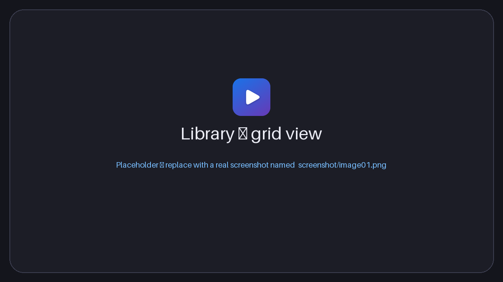
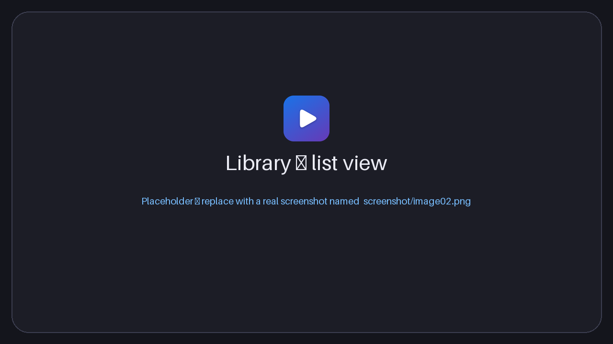
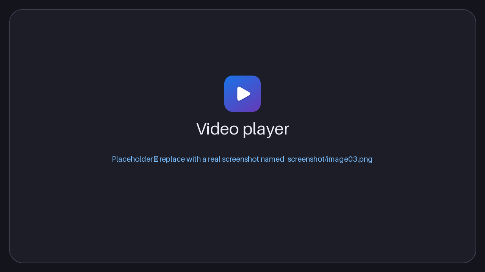
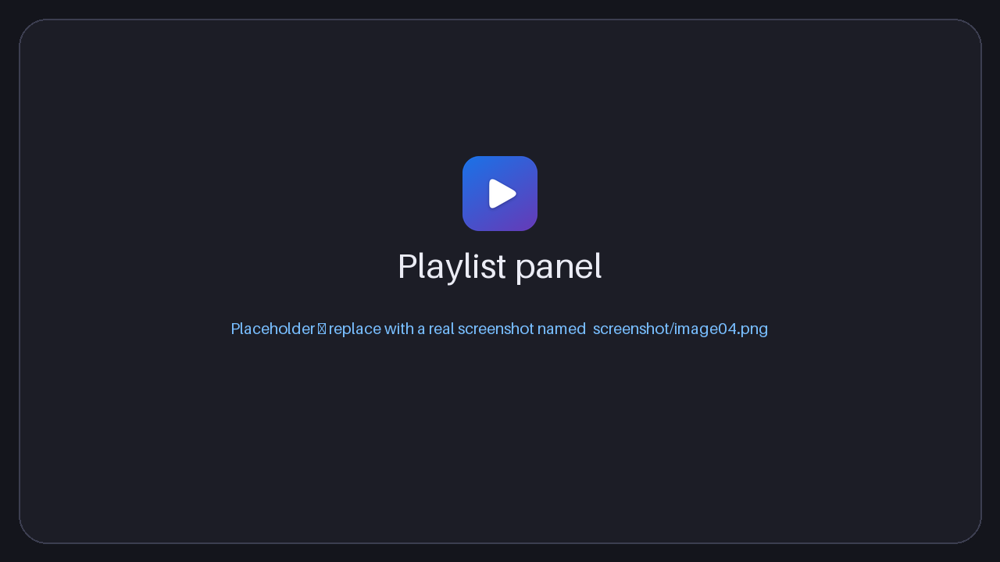
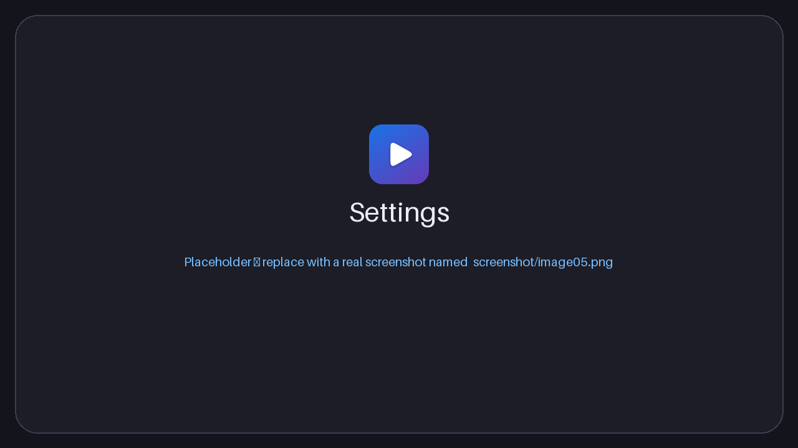

<div align="center">


# Material Video Player

**Trình phát video đầy đủ tính năng cho Windows, giao diện Material Design 3.**


[English](README.md) · Tiếng Việt

</div>

---

## Mục lục

1. [Giới thiệu](#giới-thiệu)
2. [Screenshot](#screenshot)
3. [Tính năng](#tính-năng)
4. [Download](#download)
5. [Cài đặt](#cài-đặt)
6. [Tech stack](#tech-stack)
7. [Development](#development)
8. [Build](#build)
9. [Cấu trúc project](#cấu-trúc-project)
10. [License](#license)

---

## Giới thiệu

**Material Video Player** là trình phát video cho Windows, xây dựng bằng [Tauri](https://tauri.app), React và Rust. Ứng dụng kết hợp lõi native nhẹ (dung lượng vài MB, ít tốn bộ nhớ) với giao diện **Material Design 3** hiện đại:

- **Hệ màu Material You** – toàn bộ bảng màu sinh ra từ một màu chủ đề do bạn tự chọn, ở chế độ **sáng**, **tối** hoặc **theo hệ thống**.
- Giao diện **Tiếng Việt và English**, đổi bất cứ lúc nào.
- **Font hệ thống** (`system-ui`) – dùng font gốc của Windows, không đóng gói font riêng.
- **Thư viện cá nhân** tự quét thư mục *Videos* của Windows, nhớ vị trí xem dở của từng video và tự tạo ảnh thu nhỏ.
- Đầy đủ những gì một trình phát nghiêm túc cần có: danh sách phát, phụ đề, đổi tốc độ, lặp A-B, chụp ảnh, trình phát mini, phím tắt và nhiều hơn nữa.

> ✨ Thiết kế và phát triển bởi **minhtrong67** — với sự hỗ trợ của trợ lý AI **Claude** (Anthropic).

## Screenshot

> Các ảnh nằm trong thư mục [`screenshot`](screenshot) và đặt tên `image01.png`, `image02.png`, `image03.png`… Hãy thay từng ảnh giữ chỗ bằng ảnh chụp thật, giữ nguyên tên tệp.

| Thư viện (dạng ô) | Thư viện (dạng danh sách) |
|:---:|:---:|
|  |  |

| Trình phát | Danh sách phát |
|:---:|:---:|
|  |  |

| Cài đặt |
|:---:|
|  |

## Tính năng

### Thư viện
- **Tự động quét thư mục Videos của Windows** khi mở app, gồm cả thư mục con như *Captures*, *Screen Recordings*.
- **Nút Làm mới** (thanh tiêu đề, tab Thư viện hoặc phím `F5`) quét lại ngay: thêm tệp mới, cập nhật tệp đã đổi, tệp đã xóa sẽ biến mất.
- Nhập lại tệp đã có sẽ **ghi đè** mục cũ chứ không tạo bản sao (nhận diện theo đường dẫn).
- An toàn: nếu ổ đĩa hoặc thư mục tạm thời không kết nối, video của nó vẫn được giữ lại.
- Thêm **thư mục thư viện bổ sung** trong *Cài đặt → Thư viện*.
- Tìm kiếm, sắp xếp theo ngày / tên / dung lượng, chuyển giữa **dạng danh sách và dạng ô**.
- Ảnh thu nhỏ tạo dần cho video đang hiển thị (bỏ qua khung hình đen), lưu đệm trên đĩa, có hiệu ứng khung chờ lấp lánh khi đang tạo.

### Phát video
- Mở tệp hoặc cả thư mục, kéo thả, hoặc **Mở bằng** từ Explorer; mở lần hai sẽ dùng lại cửa sổ đang chạy.
- Danh sách phát có kéo thả sắp xếp, ngẫu nhiên, lặp (tắt / tất cả / một video). Mở một tệp cũng tự thêm các video khác trong cùng thư mục (có thể tắt).
- **Xem tiếp** – nhớ vị trí của từng video, kèm mục *Xem tiếp* trên trang chủ.
- Tốc độ **0.25× – 4×**, tua từng khung hình, **lặp đoạn A-B** có đánh dấu trên thanh tua.
- Thanh tua có **ảnh xem trước khi rê chuột** và vùng đã tải.
- Con lăn chuột chỉnh âm lượng, **khuếch đại âm lượng tới 200 %**, **chế độ ban đêm** (nén dải động), nhấp đúp bên trái / phải để tua, nhấp đúp giữa để toàn màn hình.
- Hẹn giờ tắt (15 – 120 phút hoặc sau video hiện tại).

### Danh sách phát & menu chuột phải
- Thanh danh sách phát có **ô tìm kiếm**, nút chuyển **danh sách / ô** (đều có ảnh thu nhỏ), kéo thả sắp xếp, menu chuột phải cho từng mục và tự cuộn tới video đang phát.
- **Chuột phải lên video** để mở menu đầy đủ: phát / tạm dừng, tua nhanh (±10 giây, ±30 giây, ±1 phút), tốc độ, danh sách phát, phụ đề, âm thanh (tắt tiếng, chế độ ban đêm, khuếch đại), hình ảnh (vừa khung, xoay, lật, chỉnh sửa), lặp A-B, chụp ảnh, **sao chép khung hình vào clipboard**, toàn màn hình, trình phát mini, luôn ở trên cùng, thao tác tệp và đóng video.

### Hình ảnh
- Vừa khung / lấp đầy (cắt) / kéo giãn, thu phóng tới 400 % và kéo để di chuyển.
- Xoay 90°, lật ngang / dọc.
- Chỉnh độ sáng, tương phản, bão hòa, sắc độ.
- **Chụp ảnh màn hình** khung hình hiện tại, lưu PNG vào `Pictures\Material Video Player`.

### Phụ đề
- Tự tìm `.srt`, `.vtt`, `.ass`, `.ssa` cạnh video (hoặc trong thư mục `Subs` / `Subtitles`) và ưu tiên ngôn ngữ giao diện.
- Tải tệp phụ đề thủ công hoặc kéo thả vào cửa sổ.
- Tự nhận dạng bảng mã (BOM, UTF-8, Windows-1258 cho tiếng Việt, Windows-1252 cho còn lại).
- Chỉnh độ trễ (`G` / `H`), cỡ chữ, màu, nền (không / bóng / hộp), độ đậm và vị trí theo chiều dọc.

### Giao diện & ngôn ngữ
- Chủ đề sáng, tối hoặc theo hệ thống, bảng màu Material 3 sinh từ màu bất kỳ (màu có sẵn + chọn màu tùy ý).
- Giao diện Tiếng Việt và English, mặc định tự theo hệ thống.
- Chuyển động mượt kiểu Material: thẻ xuất hiện lần lượt, nhấc lên khi rê chuột, nút chuyển trượt, video hiện dần, chuyển màn hình (tự giảm khi tắt hiệu ứng động của Windows).

### Tích hợp Windows
- **Ghi nhớ kích thước, vị trí và trạng thái phóng to của cửa sổ**, lần sau mở lại đúng như cũ (chế độ toàn màn hình và mini không bao giờ bị lưu; nếu màn hình đã rút khỏi máy, cửa sổ tự về giữa màn hình).
- Tùy chọn **"Luôn mở ở chế độ toàn màn hình"** trong *Cài đặt → Cửa sổ* (nhấn `F11` hoặc `Esc` để thoát).
- Thanh tiêu đề Material tự vẽ, toàn màn hình và **trình phát mini** luôn ở trên cùng.
- Phím media của Windows và lớp phủ media của hệ thống.
- Liên kết tệp cho các định dạng video phổ biến (bộ cài tự thiết lập).

### Định dạng được hỗ trợ

Ứng dụng phát bằng bộ giải mã của **Microsoft Edge WebView2**, nên khả năng phát phụ thuộc vào codec có trên máy.

| Container | Codec thường gặp | Ghi chú |
|---|---|---|
| MP4 / M4V / MOV | H.264 + AAC | Phát tốt trên mọi máy |
| WebM | VP8 / VP9 / AV1 + Vorbis / Opus | AV1 có thể cần tiện ích *AV1 Video Extension* |
| MKV | H.264 / VP9 + AAC / Opus / MP3 | Phát được nếu codec bên trong được hỗ trợ |
| HEVC / H.265 | – | Cần cài *HEVC Video Extensions* từ Microsoft Store |
| AVI, WMV, FLV, MPG | – | Thường không hỗ trợ – ứng dụng có nút **Mở bằng ứng dụng mặc định** |

> WebView2 không cho truy cập phụ đề nhúng và nhiều track âm thanh trong tệp; hãy dùng tệp phụ đề rời.

### Phím tắt

| Phím | Chức năng | Phím | Chức năng |
|---|---|---|---|
| `Space` / `K` | Phát / tạm dừng | `M` | Tắt tiếng |
| `←` / `→` | Tua (5 / 10 / 15 giây, tùy chỉnh) | `F` / `F11` | Toàn màn hình |
| `J` / `L` | Tua 10 giây | `[` / `]` | Chậm hơn / nhanh hơn |
| `↑` / `↓` | Âm lượng | `,` / `.` | Khung hình trước / sau |
| `Shift+N` / `Shift+P` | Video tiếp / trước | `C` / `V` | Đổi / bật-tắt phụ đề |
| `G` / `H` | Độ trễ phụ đề − / + | `A` | Lặp A-B (A → B → xóa) |
| `S` | Chụp ảnh | `Q` | Danh sách phát |
| `R` | Xoay 90° | `T` | Trình phát mini |
| `0` – `9` | Nhảy tới 0 – 90 % | `I` | Thông tin video |
| `Ctrl+O` | Mở tệp (`Shift`: thư mục) | `Esc` | Thoát toàn màn hình / mini |
| `F5` | Làm mới thư viện (trang chủ) | Chuột phải | Menu ngữ cảnh |

## Download

Tải bộ cài mới nhất ở trang **Releases** của repository này:

| Tệp | Mô tả |
|---|---|
| `Material Video Player_1.0.0_x64-setup.exe` | Bộ cài cho Windows 10 / 11 (64-bit) – khuyên dùng |

**Yêu cầu hệ thống**

| | |
|---|---|
| Hệ điều hành | Windows 10 (1809 trở lên) hoặc Windows 11, 64-bit |
| Runtime | Microsoft Edge WebView2 (có sẵn trên Windows 11 và Windows 10 đã cập nhật) |
| Ổ đĩa | Chỉ cần vài trăm MB trống (bộ cài chỉ vài MB) |

Muốn tự build? Xem mục [Build](#build).

## Cài đặt

1. Chạy **`Material Video Player_1.0.0_x64-setup.exe`**. Bộ cài cài theo từng người dùng nên **không cần quyền quản trị**.
2. Nếu Windows SmartScreen hiện *"Windows protected your PC"* (bộ cài chưa ký số), bấm **More info → Run anyway**.
3. Làm theo trình cài đặt rồi mở **Material Video Player** từ Start menu.
4. Lần đầu mở, ứng dụng tự quét thư mục **Videos**. Thêm thư mục khác trong *Cài đặt → Thư viện*.

**Mở video từ Explorer** – chuột phải vào video → *Open with* → *Material Video Player* (cũng có thể đặt làm ứng dụng mặc định trong *Settings → Apps → Default apps*).

**Gỡ cài đặt** – *Settings → Apps → Installed apps → Material Video Player → Uninstall* (hoặc chạy `uninstall.exe` trong thư mục cài đặt). Cài đặt và lịch sử nằm ở `%APPDATA%\com.minhtrong67.material-video-player`, bộ nhớ đệm ảnh thu nhỏ ở `%LOCALAPPDATA%\com.minhtrong67.material-video-player`; xóa hai thư mục này nếu muốn gỡ sạch hoàn toàn.

**Khắc phục sự cố**

| Sự cố | Cách xử lý |
|---|---|
| *"Không thể phát video này"* | Codec không được WebView2 hỗ trợ. Cài *HEVC Video Extensions* (H.265) hoặc bấm **Mở bằng ứng dụng mặc định**. |
| Khuếch đại âm lượng / chế độ ban đêm không có tác dụng | Các hiệu ứng này dùng Web Audio; nếu bị chặn, hộp thoại sẽ báo và video vẫn phát bình thường. |
| Sau khi cài lại vẫn hiện icon cũ | Windows lưu cache icon – đổi tên tệp hoặc khởi động lại Explorer. |

## Tech stack

| Tầng | Công nghệ |
|---|---|
| Lõi desktop | [Tauri 2](https://tauri.app) (Rust) – single-instance, hộp thoại, asset protocol, liên kết tệp |
| Giao diện | [React 18](https://react.dev) + [TypeScript 5](https://www.typescriptlang.org) |
| Công cụ build | [Vite 5](https://vitejs.dev) |
| Styling | [Tailwind CSS 3](https://tailwindcss.com) với design token Material 3 |
| Design system | Material Design 3 – [`@material/material-color-utilities`](https://github.com/material-foundation/material-color-utilities) (màu động), icon [Material Symbols](https://fonts.google.com/icons), font `system-ui` |
| State | [Zustand](https://zustand-demo.pmnd.rs) |
| Phát video | HTML5 `<video>` trên Microsoft Edge WebView2 + Web Audio API (khuếch đại, chế độ ban đêm) |
| Rust crates | `tauri`, `tauri-plugin-dialog`, `tauri-plugin-single-instance`, `walkdir`, `encoding_rs`, `base64`, `serde` |
| Bộ cài | NSIS (qua Tauri bundler) |

## Development

**Yêu cầu**

- Windows 10 / 11 có WebView2
- [Node.js](https://nodejs.org) 18 trở lên
- [Rust](https://rustup.rs) (stable) và *Desktop development with C++* (Visual Studio Build Tools)
- Điều kiện của Tauri: <https://tauri.app/start/prerequisites/>

**Chạy khi phát triển**

```bash
cd material-video-player
npm install
npm run dev
```

`npm run dev` mở ứng dụng desktop (Tauri) với hot reload. Lần chạy đầu phải biên dịch phần Rust nên mất vài phút, các lần sau nhanh. Giao diện tự tải lại khi bạn sửa code.

**Lệnh hữu ích**

| Lệnh | Tác dụng |
|---|---|
| `npm run dev` | Chạy ứng dụng desktop (Tauri), có hot reload |
| `npm run build` | Đóng gói bộ cài cho Windows |
| `npm run vite:dev` | Chỉ chạy giao diện trên trình duyệt (các tính năng Tauri như đọc tệp không dùng được) |
| `npx tsc --noEmit` | Kiểm tra kiểu cho frontend |
| `cargo check` (trong `src-tauri`) | Kiểm tra backend Rust |

**Dùng trong workspace Cargo có sẵn** – nếu thư mục này nằm cạnh các app Tauri khác dùng chung `Cargo.toml` gốc, thêm vào `members`:

```toml
[workspace]
members = [
  # ...các app hiện có...
  "material-video-player/src-tauri",
]
```

**Tùy biến**

| Nội dung | Vị trí |
|---|---|
| Màu chủ đề mặc định | `defaultSettings.seedColor` trong `src/lib/types.ts` |
| Thêm ngôn ngữ | thêm từ điển trong `src/lib/i18n.ts` (trình biên dịch kiểm tra đủ khóa dịch) |
| Kích thước cửa sổ mặc định | `app.windows` trong `src-tauri/tauri.conf.json` |
| Đuôi video được hỗ trợ | `VIDEO_EXTS` trong `src-tauri/src/lib.rs` và `src/lib/tauri.ts` |

**Dữ liệu người dùng** – cài đặt, thư viện, lịch sử và vị trí xem dở: `%APPDATA%\com.minhtrong67.material-video-player\state.json`; kích thước cửa sổ: `window.json` cùng thư mục; ảnh thu nhỏ: `%LOCALAPPDATA%\com.minhtrong67.material-video-player\thumbs`.

## Build

```bash
npm install
npm run build
```

Kết quả (khi dự án nằm trong Cargo workspace, thư mục `target` ở gốc workspace):

| Sản phẩm | Đường dẫn |
|---|---|
| Bộ cài | `target/release/bundle/nsis/Material Video Player_1.0.0_x64-setup.exe` |
| File chạy trực tiếp | `target/release/material-video-player.exe` |

Lưu ý:
- Lần build đầu sẽ tải công cụ NSIS nên cần có internet.
- Muốn đổi phiên bản, sửa `version` ở cả `package.json` và `src-tauri/tauri.conf.json`.
- Bộ cài chưa ký số; xem [hướng dẫn ký của Tauri](https://tauri.app/distribute/sign/windows/) nếu bạn muốn ký.

**Icon** – icon ứng dụng, icon bộ cài (setup) và icon gỡ cài đặt (uninstall) dùng chung một hình và có đủ mọi kích thước hiển thị chuẩn của Windows:

| Tệp | Dùng cho | Kích thước |
|---|---|---|
| `src-tauri/icons/icon.ico` | ứng dụng, thanh tác vụ, Explorer, cửa sổ | 16, 20, 24, 32, 40, 48, 64, 96, 128, 256 px |
| `src-tauri/icons/installer.ico` | tệp setup `.exe` **và** `uninstall.exe` | 16, 20, 24, 32, 40, 48, 64, 96, 128, 256 px |
| `32x32.png`, `64x64.png`, `128x128.png`, `128x128@2x.png` (256), `256x256.png`, `icon.png` (512) | Tauri / bundler / màn hình độ phân giải cao | theo tên tệp |

Muốn dùng hình khác, thay `src-tauri/icons/icon.png` (vuông, ≥ 512 px) rồi chạy `npx tauri icon src-tauri/icons/icon.png`, sau đó giữ đủ các kích thước chuẩn trong `installer.ico`.

## Cấu trúc project

```
material-video-player/
├─ screenshot/                ảnh chụp dùng trong README (image01.png … image05.png)
├─ public/                    tài nguyên tĩnh (logo dùng trong giao diện)
├─ src/                       frontend React + TypeScript + Tailwind
│  ├─ main.tsx                điểm vào
│  ├─ App.tsx                 bố cục, phím tắt toàn cục, kéo thả, chủ đề
│  ├─ index.css               token Material 3, chuyển động, slider
│  ├─ lib/
│  │  ├─ store.ts             trạng thái ứng dụng (zustand): hàng chờ, thư viện, phát, cài đặt
│  │  ├─ engine.ts            tiện ích <video>, tua khung hình, khuếch đại / chế độ ban đêm, chụp ảnh
│  │  ├─ i18n.ts              từ điển English / Tiếng Việt
│  │  ├─ theme.ts             sinh bảng màu Material 3 từ màu chủ đề
│  │  ├─ subtitles.ts         bộ đọc SRT / VTT / ASS
│  │  ├─ thumbs.ts            tạo ảnh thu nhỏ (bỏ qua khung hình đen)
│  │  ├─ videoMenu.ts         menu chuột phải của video
│  │  ├─ tauri.ts, window.ts  cầu nối tới lệnh Rust và tiện ích cửa sổ
│  │  └─ types.ts, utils.ts, useT.ts
│  ├─ components/             Player, Controls, SeekBar, VideoSurface, Subtitles, QueuePanel,
│  │                          Poster, Dialogs, TitleBar, ViewToggle, ui (bộ M3)
│  └─ views/                  Home (gần đây + thư viện), Settings
├─ src-tauri/                 backend Rust
│  ├─ src/lib.rs              lệnh: quét, phụ đề, lưu trạng thái, ảnh chụp, nhớ cửa sổ
│  ├─ src/main.rs             điểm vào
│  ├─ capabilities/           quyền của Tauri
│  ├─ icons/                  icon ứng dụng, setup và uninstall
│  ├─ Cargo.toml
│  └─ tauri.conf.json         cấu hình ứng dụng, cửa sổ, bộ cài, liên kết tệp
├─ README.md / README.vi.md
├─ package.json, vite.config.ts, tailwind.config.js, tsconfig.json
└─ LICENSE
```

## License

Phát hành theo [Giấy phép MIT](LICENSE) © 2026 minhtrong67.

Thiết kế và phát triển bởi **minhtrong67** với sự hỗ trợ của trợ lý AI **Claude** (Anthropic). Xây dựng với [Tauri](https://tauri.app), [React](https://react.dev), [Tailwind CSS](https://tailwindcss.com), [Zustand](https://zustand-demo.pmnd.rs), [Material Color Utilities](https://github.com/material-foundation/material-color-utilities) và [Material Symbols](https://fonts.google.com/icons).
