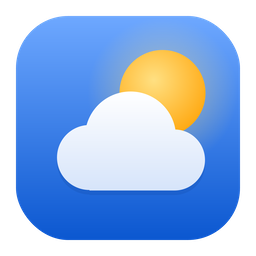
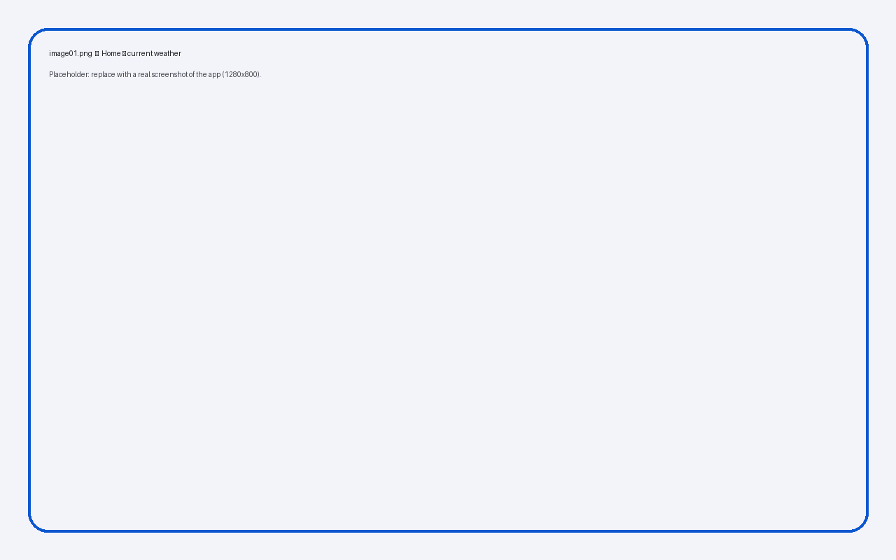
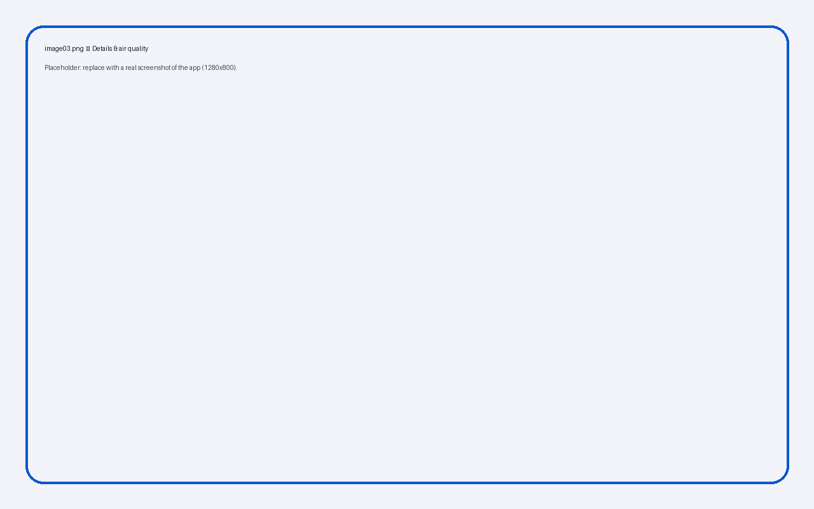
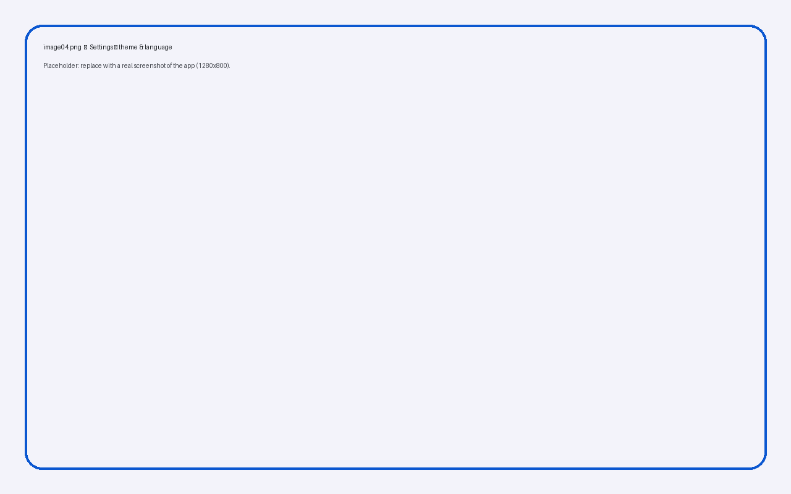

<div align="center">



# Material Weather

**A fast, beautiful desktop weather app — Material Design 3, built with Tauri 2.**


Created by **`minhtrong67`** with the support of **Claude** (Anthropic)

</div>

## Introduction

**Material Weather** is a lightweight cross-platform desktop app that shows live conditions, an hourly outlook, a 7-day forecast and air quality for any city in the world. It follows **Material Design 3**: dynamic colour from a seed colour, light / dark / system themes, tonal surfaces, ripples and motion that stays out of your way. The UI is available in **English** and **Tiếng Việt**.

Weather data comes from [Open-Meteo](https://open-meteo.com/) — free, no API key required.

## Screenshots

| | |
|---|---|
|  |  |
|  |  |

> The files in `screenshots/` are placeholders — replace `image01.png` … `image04.png` with real screenshots.

## Features

- **Live weather** — temperature, feels-like, condition, humidity, wind (speed, direction, gusts), pressure, UV index, visibility, cloud cover, precipitation.
- **Hourly forecast** — next 24 hours with an animated temperature curve and rain probability.
- **7-day forecast** — daily range bars with a marker for the current temperature.
- **Air quality** — US AQI with colour-coded category and PM2.5.
- **Sun** — sunrise, sunset, daylight length and live sun position on an arc.
- **Location with permission** — “Use my location” explains why it is needed and asks for your permission (OS prompt); if it is blocked or unavailable you get clear instructions and can fall back to an approximate, IP-based location.
- **Search & places** — city search with autocomplete and saved locations.
- **Smart tips** — umbrella, UV, air-quality, heat/cold and wind advice generated from the forecast.
- **Moon phase & dew point** — computed locally, no extra API calls.
- **Copy summary** — one click copies a short weather summary to the clipboard.
- **Always on top** — pin the window above other apps (top bar button or Settings).
- **Weather effects** — animated rain, snow, clouds, stars, sun glow and lightning on the main card (can be turned off).
- **Themes** — light / dark / system, 8 preset colours plus a custom colour picker (real Material 3 tonal palettes).
- **Languages** — English and Tiếng Việt, switchable instantly.
- **Units** — °C / °F and km/h / m/s / mph.
- **Window option** — *remember window size* or *always open maximized*.
- **Offline friendly** — last data is cached and shown when you are offline; auto refresh every 15 minutes.
- **Keyboard shortcuts** — `Ctrl+K` or `/` search · `F5` / `Ctrl+R` refresh · `Ctrl+,` settings · `Alt+↑/↓` switch location · `Esc` close.
- **Polish** — ripples, staggered entrance animations, skeleton loading, reduced-motion support, pause when the window is hidden.

## Installation

Download the installer for your platform from the build output (see [Build](#build)) and run it:

| Platform | File |
|---|---|
| Windows | `Material Weather_1.0.0_x64-setup.exe` (NSIS, English + Tiếng Việt installer) |
| macOS | `Material Weather_1.0.0_*.dmg` |
| Linux | `.deb` / `.AppImage` |

## Tech stack

| Layer | Technology |
|---|---|
| Shell | [Tauri 2](https://tauri.app/) (Rust) |
| UI | Vanilla JavaScript (ES modules) + Vite 6 |
| Design | Material Design 3, `@material/material-color-utilities`, `system-ui` font |
| Data | Open-Meteo forecast, geocoding & air-quality APIs · BigDataCloud (reverse geocoding) · ipwho.is / geojs.io / ipapi.co (approximate IP location fallback) |

## Development

Requirements: [Node.js 18+](https://nodejs.org/), [Rust](https://rustup.rs/) and the [Tauri prerequisites](https://tauri.app/start/prerequisites/) for your OS.

This project lives inside a **Cargo workspace** (root `Cargo.toml` with `members = ["*/src-tauri"]`) and shares one `./target` build cache with the other Tauri projects.

```bash
cd material-weather
npm install      # install dependencies
npm run dev      # start Tauri in development mode (hot reload)
```

## Build

```bash
npm run build    # production build + installers
```

Because of the workspace, installers are written to the **workspace root**: `../target/release/bundle/` (e.g. `nsis/Material Weather_1.0.0_x64-setup.exe`).

### Icons

All icon sources are in `design/` (app, setup and uninstall icons). To regenerate them:

```bash
pip install cairosvg pillow
python design/gen_icons.py          # setup/uninstall .ico + installer images
npx tauri icon design/app-icon.png  # app icons for every platform
```

## Project structure

```
material-weather/
├── design/                  # icon sources (SVG) + generator script
├── public/                  # logo & favicon
├── screenshots/             # image01.png … image04.png
├── src/
│   ├── main.js              # app bootstrap & orchestration
│   ├── lib/                 # api, store, i18n, theme, window, fx, icons, formatters
│   ├── locales/             # en.js, vi.js
│   ├── ui/                  # view templates, dialogs, search, ripple, toast
│   └── styles/              # tokens, base, components, weather
├── src-tauri/
│   ├── src/                 # main.rs, lib.rs
│   ├── capabilities/        # window / opener permissions
│   ├── icons/               # app, setup & uninstall icons
│   ├── installer/           # NSIS header/sidebar images + hooks
│   ├── Cargo.toml
│   └── tauri.conf.json
├── index.html
├── package.json
└── vite.config.js
```

## Privacy

No account and no tracking. Your precise location is requested only after you press **Use my location** (or on first launch) and you allow it; it is used to fetch the forecast and a place name and is kept only on your computer. Approximate IP-based location is used only if you choose it or if precise location is unavailable. Requests go only to Open-Meteo, BigDataCloud and the IP-location providers listed above.

### If location is blocked

- **Windows:** Settings → Privacy & security → Location → turn on *Location services* and *Let desktop apps access your location*, then press *Try again* in the app.
- **macOS:** System Settings → Privacy & Security → Location Services.
- **Linux:** precise location may be unavailable in WebKitGTK; the app falls back to the approximate location.

## License

Released under the [MIT License](LICENSE).

<div align="center">

Made with ♥ by **minhtrong67** × **Claude**

</div>
