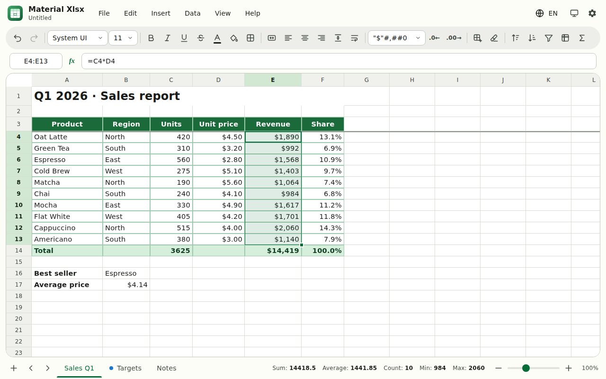
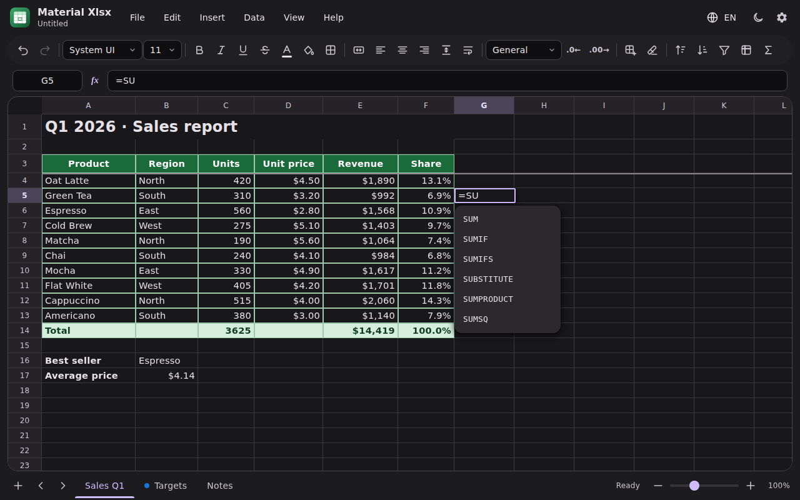
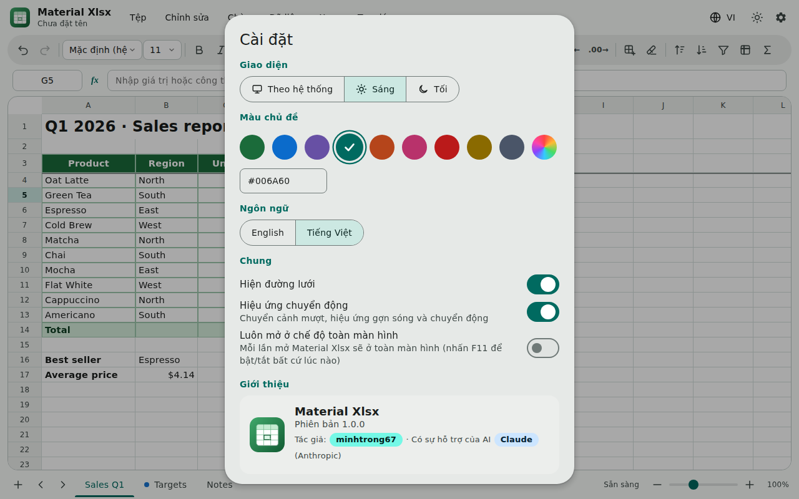
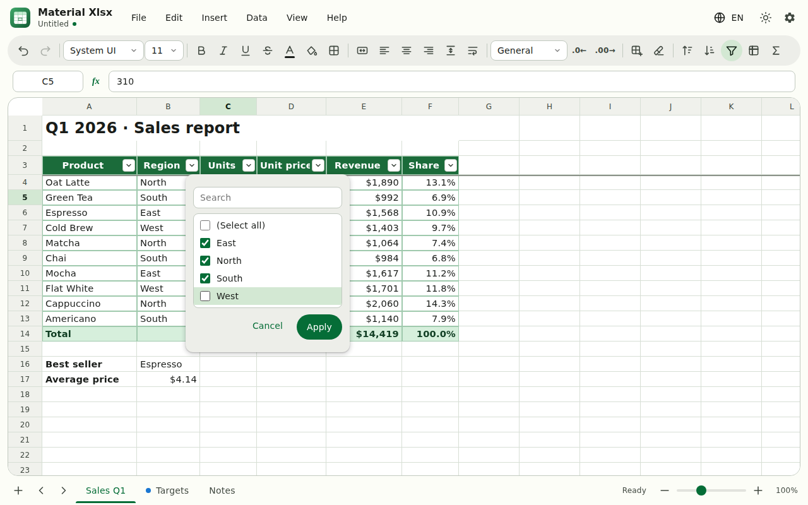
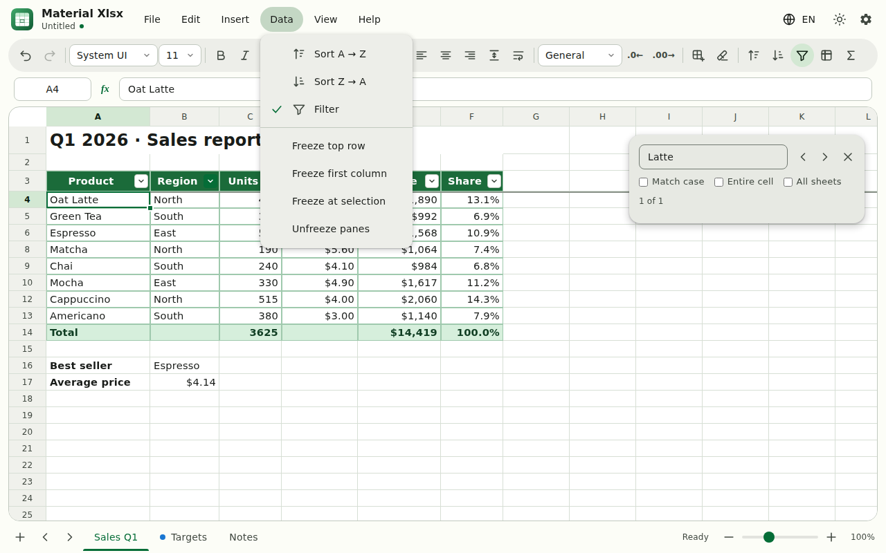

<div align="center">


# Material Xlsx

**Trình soạn thảo bảng tính `.xlsx` đơn giản, nhanh và đẹp — xây dựng bằng Tauri 2 và Material Design 3.**

[English](README.md) · Tiếng Việt


Tác giả **`minhtrong67`** · Có sự hỗ trợ của AI **`Claude`** (Anthropic)

</div>

---

## Giới thiệu

Material Xlsx là phần mềm bảng tính gọn nhẹ thay thế Microsoft Excel cho công việc hằng ngày: mở, chỉnh sửa và lưu tệp `.xlsx` với công thức, định dạng, sắp xếp, bộ lọc và nhiều sheet — trong giao diện **Material Design 3** của Google, tự theo giao diện sáng/tối của hệ thống và màu chủ đề do bạn chọn.

Toàn bộ công cụ bảng tính (bộ phân tích công thức, bộ tính toán, lịch sử hoàn tác, lưới ảo hoá) viết bằng JavaScript thuần chạy trong WebView gốc của Tauri nên bộ cài nhỏ và khởi động nhanh. Rust đảm nhiệm việc đọc/ghi tệp, clipboard hệ thống và ghi nhớ trạng thái cửa sổ.

## Ảnh chụp màn hình

| | |
|---|---|
|  |  |
| *Giao diện sáng: công thức, định dạng số, tiêu đề gộp ô, cố định hàng đầu* | *Giao diện tối với màu tuỳ chọn và gợi ý hàm* |
|  |  |
| *Cài đặt bằng tiếng Việt: giao diện, màu, ngôn ngữ, toàn màn hình* | *Bộ lọc cột có ô tìm kiếm* |
|  | |
| *Menu Dữ liệu và bảng Tìm & Thay thế* | |

## Tính năng

**Bảng tính**
- Nhiều sheet: thêm, đổi tên (nhấp đúp), nhân bản, sắp xếp thứ tự, tô màu thẻ, xoá
- **Hơn 110 hàm** — toán học, thống kê, logic, văn bản, ngày giờ, tra cứu (`SUM`, `AVERAGE`, `IF`, `IFS`, `SUMIFS`, `COUNTIFS`, `VLOOKUP`, `XLOOKUP`, `INDEX/MATCH`, `TEXT`, `TEXTJOIN`, `DATE`, `EDATE`…), tham chiếu giữa các sheet, vùng cả cột (`A:A`), phát hiện tham chiếu vòng và các lỗi `#N/A`, `#DIV/0!`…
- Gợi ý hàm khi gõ (hàm phổ biến lên đầu); nhấp ô để chèn tham chiếu khi đang nhập công thức
- Định dạng ô: phông, cỡ chữ, đậm/nghiêng/gạch chân/gạch ngang, màu chữ và màu nền, đường viền, căn lề, xuống dòng, gộp ô
- Định dạng số: chung, số, hàng nghìn, tiền tệ (`$`, `₫`, `€`), phần trăm, khoa học, ngày giờ, văn bản và **mã tuỳ chỉnh**; tăng/giảm số thập phân
- Sắp xếp A→Z / Z→A (tự nhận hàng tiêu đề), **bộ lọc** cột có tìm kiếm, **cố định hàng/cột**
- Tay nắm tự điền: chuỗi số, ngày, `Mục 1, Mục 2…` và sao chép công thức tương đối, `Ctrl+D` / `Ctrl+R`
- Sao chép / cắt / dán (kể cả với Excel), dán chỉ giá trị, dán chỉ định dạng
- Chèn / xoá hàng và cột, công thức tự điều chỉnh
- Hoàn tác / làm lại, tìm và thay thế (phân biệt hoa thường, khớp toàn ô, mọi sheet), tính tổng tự động, hộp tên ô, thống kê ở thanh trạng thái
- Thu phóng 50–200 %, kéo đổi cỡ hàng/cột (nhấp đúp để tự khớp), in
- Lưới ảo hoá — hơn 100.000 hàng vẫn mượt

**Tệp**
- Mở / lưu **`.xlsx`** (style, gộp ô, độ rộng, cố định ngăn, bộ lọc, công thức kèm giá trị đã tính), mở và nhập **CSV / TSV**, xuất sheet hiện tại ra CSV
- Tệp gần đây, kéo thả tệp vào cửa sổ, nhắc lưu khi có thay đổi, hỗ trợ "Mở bằng"

**Thiết kế và trải nghiệm**
- Material Design 3 với phông mặc định `system-ui`
- Giao diện **Sáng / Tối / Theo hệ thống** + **màu chủ đề tuỳ chỉnh**
- Hiệu ứng: gợn sóng khi bấm, menu và hộp thoại chuyển động, thanh trượt dưới thẻ sheet, chuyển theme dạng lan tròn, khung chọn di chuyển mượt, viền chạy khi sao chép, nháy sáng khi dán / điền / sắp xếp — có thể tắt trong Cài đặt (và tôn trọng thiết lập giảm chuyển động của hệ điều hành)
- Giao diện **tiếng Anh và tiếng Việt**, đổi tức thì
- **Ghi nhớ kích thước cửa sổ**, vị trí và trạng thái phóng to; tuỳ chọn **luôn mở toàn màn hình** (nhấn `F11` để bật/tắt)
- Bộ icon đầy đủ: icon ứng dụng, icon file cài đặt (setup) và icon gỡ cài đặt (uninstall)

## Tải về

Bộ cài dựng sẵn được đăng ở trang **[Releases](https://github.com/minhtrong67/material-xlsx/releases)**.

| Nền tảng | Tệp |
|---|---|
| Windows 10 / 11 | `Material Xlsx_1.0.0_x64-setup.exe` (NSIS) hoặc `.msi` |
| macOS | `.dmg` (build trên máy Mac) |
| Linux | `.deb` / `.AppImage` (build trên Linux) |

## Cài đặt

1. Tải bộ cài phù hợp ở trang Releases.
2. Chạy bộ cài và làm theo hướng dẫn (Windows cần WebView2, đã có sẵn trên Windows 10/11).
3. Mở **Material Xlsx** từ Start menu rồi mở hoặc kéo thả tệp `.xlsx`.

Gỡ cài đặt bằng *Settings → Apps* hoặc lối tắt **Uninstall Material Xlsx**.

## Công nghệ

| Lớp | Công nghệ |
|---|---|
| Khung ứng dụng | [Tauri 2](https://tauri.app) (Rust) + plugin `dialog`, `opener`, `window-state` |
| Crate Rust | `serde`, `base64`, `arboard` (clipboard) |
| Giao diện | HTML, CSS và JavaScript thuần (ES modules, không cần bundler) |
| Hệ thiết kế | Material Design 3, màu sinh bằng `@material/material-color-utilities` |
| Công cụ bảng tính | Bộ phân tích Pratt + bộ tính toán tự viết, mô hình ô bất biến với hoàn tác bằng snapshot |
| Đọc/ghi XLSX | [ExcelJS](https://github.com/exceljs/exceljs) |
| Hiển thị | Đường lưới bằng Canvas + ô DOM ảo hoá trong bốn khung (hỗ trợ cố định ngăn) |

## Phát triển

Yêu cầu: [Node.js 18+](https://nodejs.org), [Rust](https://rustup.rs) và [các thành phần cần thiết của Tauri](https://tauri.app/start/prerequisites/) cho hệ điều hành của bạn.

Dự án là thành viên của Cargo workspace (`members = ["*/src-tauri"]`) nên tự được nhận khi thư mục nằm cạnh các app Tauri khác và dùng chung một bộ nhớ đệm build `./target`.

```bash
cd material-xlsx
npm install        # cài Tauri CLI
npm run dev        # chạy app ở chế độ phát triển
npm test           # kiểm thử công thức, định dạng số và mô hình dữ liệu
```

## Build

```bash
npm run build
```

Bộ cài nằm trong `target/release/bundle/` của workspace (ví dụ `nsis/Material Xlsx_1.0.0_x64-setup.exe`). Icon setup và uninstall được cấu hình trong `src-tauri/tauri.conf.json` (`installerIcon`, `uninstallerIcon`).

## Cấu trúc dự án

```
material-xlsx/
├─ package.json            lệnh npm: dev, build, test
├─ screenshot/             ảnh cho README (image01 … image05)
├─ tests/                  kiểm thử (công thức, định dạng số, mô hình)
├─ src/                    giao diện
│  ├─ index.html           khung trang + bộ icon SVG
│  ├─ styles.css           style Material Design 3 + chuyển động
│  ├─ vendor/              ExcelJS, Material colour utilities (đóng gói sẵn, chạy offline)
│  └─ js/                  main, app, grid, model, formula, refs, numfmt, io, i18n, theme, widgets, tauri
└─ src-tauri/              backend Rust
   ├─ Cargo.toml  tauri.conf.json  build.rs
   ├─ capabilities/        quyền cửa sổ / hộp thoại
   ├─ icons/               icon app, installer.ico, uninstaller.ico, logo Store
   └─ src/                 main.rs, lib.rs (đọc/ghi tệp, clipboard, trạng thái cửa sổ)
```

## Hạn chế đã biết

Biểu đồ, hình ảnh, pivot table, định dạng có điều kiện và data validation chưa được hiển thị và sẽ không được giữ lại khi lưu. Hàm mà Material Xlsx chưa hỗ trợ sẽ dùng giá trị đã lưu sẵn trong tệp.

## Giấy phép

Phát hành theo [MIT License](LICENSE) © 2026 **minhtrong67**.

<div align="center">

Thực hiện bởi **minhtrong67** · Trợ lý AI **Claude**

</div>
